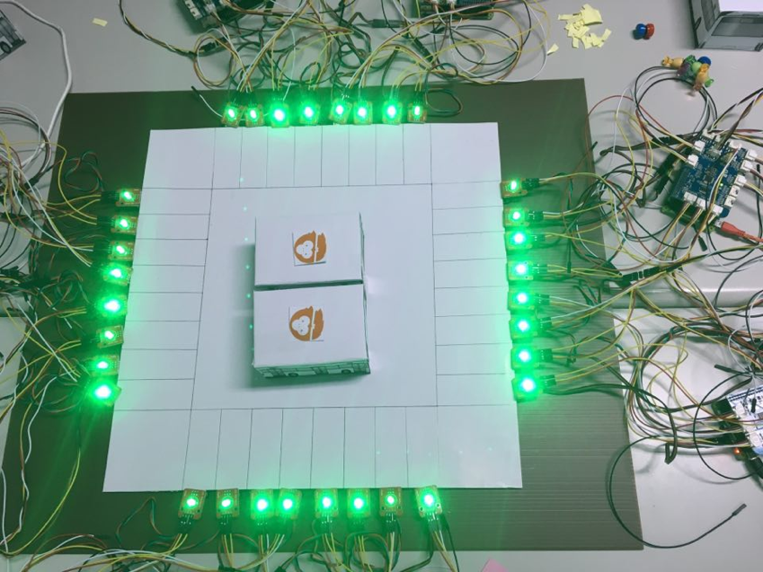

# Distributed, Dynamic Parking systems
> Department of Computer Science and Information Engineering, National Taiwan University (NTUCSIE) \
> [Design for IoT Middleware (2017, Fall)](https://ceiba.ntu.edu.tw/course/3e1205/index.htm) - Final Project

## Collaborators :
NTU-CSIE 顏逸東(Yan.YiDong)
NTU-CSIE 謝崴宇(Hseih.WeiYu)
NTU-EECS 吳明憲(Ｗu.MingSian) ([github](https://github.com/spadek67424))

## System Introduction :

### Abstract :
    Distributed, dynamic parking system aim to provide more parking spaces. The system work in raspberryPi or other tiny computer, and the computer will be installed at every parking lot. 

### communication and sensors : 

    Communication between computers is implemented with [MQTT](https://swf.com.tw/?p=1002), and parking event is triggered by magnetic sensors. For demo, every parking space show whether vacant or not with LED sensor, which green light represent vacant and red one represent parked. 

### Algorithm :

